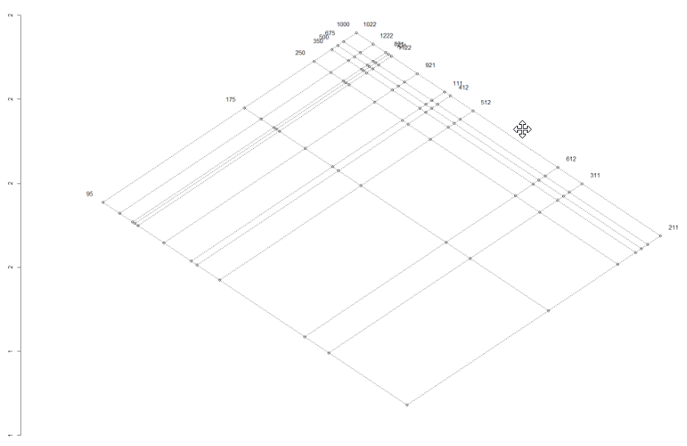

#Solutions
1. Five R's of EDA
    + Resistance : The ability of the statistic/method to have minimum influence from an "Outlier" and remain faithful to the main body of the data points
     + Residuals : Examining Residuals to describe the quality of the fit, if required so using residuals as iterative parameters to update the fit.
     + Reexpression : Using Linear methods of Data Transformation to fit the data to $y = model + Residuals$ so that we might be able to analyse models that deviate from gaussian model
     + Revelation : Using Exploratory tools like Scatter Plots, Histograms, Residual vs Fit plots for data visualization, outlier detection and model conformance cheching.
     + Re-iteration : Iterative data fitting, can be best seen in resistant methods like Resistant Regression and Median polish where Residuals/Row-Column effects are calculated iteratively and consumed in the successive fits.

2. Five Number Summary :
   Five number summary gives an overall description of the data described by parameters 
    + Sample Minimum
    + First Quantile
    + Median
    + Third Quantile
    + Sample Maximum
    
    ```{r}
    #Generate 10 random numbers with mean 7 and sd 1
    set.seed(1)
    population <- rnorm(10,7,1)
    
    #display population
    print (population)
    
    #display 5 number summary
    fivenum(population)
    summary(population)
    ```
  
3. Goals for Re-Expressing Data
    + Finding a suitable scale for data representation, Eg: Logrithmic, Square root etc for dimplyfying data analyis
    + Finding an transformation which promotes symmetry and transforms the data to a known distribution like Gaussian
    + Transforms data for straightness, spread etc to emphasis the straightness of an relationship
    + Convert complex multiplicative models to simple additive models with reduced complexity, Eg log transform converts a model say $y=ab$ to $\log{y}=\log{a}+\log{b}$
    + Changing the scale of measurement to comply with the nature of the data
    
4. Detecting Long-Tailness
    + Long Tailness can be detected using visual methods like Histograms or q-q Plots.
    
    ```{r}
    set.seed(123)
    
    #Generate a tailed distribution
    sample.pop<-rgamma(1000,shape=1)
    par(mfrow=c(1,1),mfcol=c(1,2))
    
    #Plot Histograms and q-q plots
    hist(sample.pop,main="Histogram")
    qqnorm(sample.pop)
    qqline(sample.pop,col="red")
    ```
    
    + In the above example it can be seen that the distribution has heavy left tails, and this can be visually seen in both Histogtam and q-q plots.
    
    + Inorder to transform such data, few methods are Tukey's Power Transform, Transform for Symmetry and Transform for Straightness.
    
    + Tukey's power transform involves finding suitable power function to either "Pull In" or "Push out" the data points. example, for the above said distribution, we would need to pull in data, and according to Tukey's Power Transformation a cube root transform would be necessary.
    
    ```{r}
    # Do a Cube Root Transform
    sample.trans<-sample.pop^(1/3)
    par(mfrow=c(1,1),mfcol=c(1,2))
    
    #Plot the tail detection visualizations
    hist(sample.trans,main="Histogram")
    qqnorm(sample.trans)
    qqline(sample.trans,col="red")
    ```
    
    + Other Methods like transforming for straightness and Spread involves plotting an letter value plot and using their fourth spread and midsummaries to calculate required parameters for data transformation.
5. g-h estimates\
    From the Theory of G and H estimates,
    
    + g = 0 indicates no skewness, g $\le$ 0.25 = Slight Skewness, g ~ 1 implies highly skewed
    + h = 0, No long tails, h $\ge$ 0 then increasingly longer tails
    
    Given that the given gh estimates,
    + (-0.5,0.3) has negative skewness and has light tails
    + (0.5,0.3) has positive skewness and light tails
    + (1,0.6) has high positive skewness and heavy tails
6. 
  a) q-q Plot
    ```{r}
    a=c(1092,1137,1197,1237,1301,1523,1577,1619,1626,1644,1672,1748,1768,1780,1796,1816,1843,1844,1902,1919,1983,1993,2025,2028,2032,2036,2072,2078,2090,2137,2162,2163,2180,2185,2194,2225,2230,2233,2234,2235,2265,2270,2274,2281,2289,2319,2322,2357,2381,2398,2421,2421,2443,2522,2549,2552,2581,2618,2618,2620,2624,2642,2647,2666,2705,2721,2740,2804,2819,2823,2860,2873,2906,2913,2926,2929,2931,2931,2934,2939,2961,3020,3023,3044,3047,3048,3096,3174,3190,3199,3204,3222,3225,3278,3287,3292,3300,3339,3361,3412,3462,3503,3530,3589,3672,3734,3749,3783,3854,3901,3932,3995,4001,4006,4118,4134,4320,4346,4385,4401,4522,4565,4581,4593,4629,4855,4868,4878,4885,4907,4962,4975,5021,5127,5155,5160,5183,5229,5242,5379,5383,5513,5555,5619,5755,5774,5890,5899,5988,6161,6185,6818,7406,7419,8175,8220,8282,8827,9027,9042,9805)
    # Plot QQ Plot
    par(mfrow=c(1,2))
    qqnorm(a,main="q-q Plot")
    # Plot QQ Line
    qqline(a)
    #Histogram
    hist(a,main="Histogram")
    ```
    
    By interpeting both Q-Q Plot and the Histogram, it is evident that the distribution of the given popultaion has light left tail and an heavy right tail. This is also evident in the histogram.
    
    b) 
    ```{r}
    source("lvalprogs.r")
    source("rrline.r")
    ll<-lval(a)
    print(ll)
    ```
    There are 9 Levels, Hence the probability of expected quantile is $\frac{1}{{2}^{9}}$
    
    ```{r}
    pp1 <- 1/2^(1:nrow(ll)-1)
    gau1 <- abs(qnorm(pp1))
    pp2 <- abs((pp1-1/3)/(nrow(ll)-1 + 1/3))
    gau2 <- abs(qnorm(abs(pp2)))
    est2.g <- log((ll[,3] - ll[1,2])/(ll[1,2]-ll[,2]))/gau2
    print(round(cbind(pp1,pp2,gau1,gau2,est2.g),5))
    
    #Plot L-Val Values Vs the G estimate
    plot(1:8, est2.g[-1],
    xlab = "Letter value number (1=F, 2=E, 3=D, ... , 8=Y)",
    ylab = "Estimate of g")
    abline(h=median(est2.g[-1]))
    text(6.5,0.51,paste("median g = ",format(round(median(est2.g[-1]),3))))
    
    # Estimation of g
    est.g <- median(est2.g[-1]) 
    print(est.g)
    
    #Estimation of A and B
    zp <- c(rev(qnorm(pp2)),abs(qnorm(pp2)))
    yy <- c(rev(ll[,2]),ll[,3])
    est.Y <- (exp(est.g*zp)-1)/est.g
    #print(cbind(est.Y,yy))
    plot(est.Y,yy,main="Estimate A and B")
    rr <- run.rrline(est.Y,yy)
    abline(rr$a, rr$b)
    print(paste("A Estimate ",rr$a," B Estimate ",rr$b))
    ```
    
    The G Estimates are as follows, g= 0.68, A= 2796, B=1127.
    
    c) Bootstrap Estimates
    ```{r,results="hide"}
  library(ggplot2)
  library(GGally)
  g.dist.estimates<-function(sample.pop){
  source("lvalprogs.r")
  source("rrline.r")
  ll<-lval(sample.pop)
  pp1 <- 1/2^(1:nrow(ll)-1)
  gau1 <- abs(qnorm(pp1))
  pp2 <- abs((pp1-1/3)/(nrow(ll)-1 + 1/3))
  gau2 <- abs(qnorm(abs(pp2)))
  est2.g <- log((ll[,3] - ll[1,2])/(ll[1,2]-ll[,2]))/gau2
  
  # Estimation of g
  est.g <- median(est2.g[-1]) 
  p <- c(0.005, 0.01, 0.025, 0.05, 0.1, 0.25, 0.5, 0.75, 0.9, 0.95, 0.975, 0.99, 0.995)
  zp <- qnorm(p)
  est.Y <- (exp(est.g*zp)-1)/est.g
  rr <- run.rrline(est.Y,quantile(sample.pop,p))
  #Run Resistant Regression for A and B Estimates
  return (list(g=est.g,A=rr$a,B=rr$b))
}


bootstrap.g<-function(pops,sims){
  g.est <- c()
  A.est <- c()
  B.est <- c()
  for (i in 1:sims){
    boot.sample<-sample(pops,length(pops),replace = TRUE)
    r.val <- g.dist.estimates(boot.sample)
    g.est[i]<-r.val$g
    A.est[i]<-r.val$A
    B.est[i]<-r.val$B
  }
  best.g <- mean(g.est)
  g.lower <- best.g - qt(0.95,df=length(g.est)-1)*sd(g.est)
  g.upper <- best.g + qt(0.95,df=length(g.est)-1)*sd(g.est)
  best.A <- mean(A.est)
  A.lower <- best.A - qt(0.95,df=length(A.est)-1)*sd(A.est)
  A.upper <- best.A + qt(0.95,df=length(A.est)-1)*sd(A.est)
  best.B <- mean(B.est)
  B.lower <- best.B - qt(0.95,df=length(B.est)-1)*sd(B.est)
  B.upper <- best.B + qt(0.95,df=length(B.est)-1)*sd(B.est)
  cor.est <- cor (cbind(g.est,A.est,B.est))
  es.plt <- ggpairs(as.data.frame(cbind(g.est,A.est,B.est)))
  return(list(g=best.g,a=best.A,b=best.B,g.lower,g.upper,A.lower,A.upper,B.lower,B.upper,cor.est,es.plt))
}


a<-c(1092,1137,1197,1237,1301,1523,1577,1619,1626,1644,1672,1748,1768,1780,1796,1816,1843,1844,1902,1919,1983,1993,2025,2028,2032,2036,2072,2078,2090,2137,2162,2163,2180,2185,2194,2225,2230,2233,2234,2235,2265,2270,2274,2281,2289,2319,2322,2357,2381,2398,2421,2421,2443,2522,2549,2552,2581,2618,2618,2620,2624,2642,2647,2666,2705,2721,2740,2804,2819,2823,2860,2873,2906,2913,2926,2929,2931,2931,2934,2939,2961,3020,3023,3044,3047,3048,3096,3174,3190,3199,3204,3222,3225,3278,3287,3292,3300,3339,3361,3412,3462,3503,3530,3589,3672,3734,3749,3783,3854,3901,3932,3995,4001,4006,4118,4134,4320,4346,4385,4401,4522,4565,4581,4593,4629,4855,4868,4878,4885,4907,4962,4975,5021,5127,5155,5160,5183,5229,5242,5379,5383,5513,5555,5619,5755,5774,5890,5899,5988,6161,6185,6818,7406,7419,8175,8220,8282,8827,9027,9042,9805)
bs.val <- bootstrap.g(a,1000)
    ```
    ```{r,tidy=TRUE, tidy.opts=list(width.cutoff=60)}
print(paste("The g Estimate is ",bs.val[1]))
print(paste(" and Confidence interval is between",bs.val[4]," and ",bs.val[5]))
print(paste("The A Estimate is ",bs.val[2]))
print(paste(" and Confidence interval is between",bs.val[6]," and ",bs.val[7]))
print(paste("The B Estimate is ",bs.val[3]))
print(paste(" and Confidence interval is between",bs.val[8]," and ",bs.val[9]))
    ```
    + Correlation Matrix :
    ```{r}
    print(bs.val[10])
    ```
    
    + Pairs Plot:
    ```{r}
    print(bs.val[11])
    ```
    D) Transforming back to Normalcy :
    
    Given the values, transforming this to normalcy.
    
```{r}
g<-bs.val$g
A<-bs.val$a
B<-bs.val$b
z<- 1/g*log(((a-A)*g)/B +1)
par(mfrow=c(1,2))
hist(z)
qqnorm(z)

```

  Once transformed, both the tails are now less affected and is near to the normal distribution. However, there is still skewness in the left tail.
  
E) GoF Tests
        + Pearson's Test
        
    ```{r}
          gof.pearson=function (x,nbins) {
        n = length(x) 
        m = floor(n/nbins) 
        k = n - m*nbins # This is the remainder 
        xx=sort(x) 
        index = rep(1:nbins,m)
        if(k >0){ d=sample(1:nbins,k,replace=FALSE); 
        index=c(index,d) } 
        bincount=as.numeric(table(index)) 
        binindicies = cumsum(bincount) 
        binbreaks = rev(rev(xx[binindicies])[-1]) 
        binbreaks = c(-Inf,binbreaks,Inf) 
        bins=cut(x,breaks=binbreaks)
        internalbreaks = rev(rev(xx[binindicies])[-1]) 
        p = pnorm(internalbreaks,mean(x),sd(x))
        p = c(p[1],diff(p),1-pnorm(max(internalbreaks),mean(x),sd(x)))
        exp = n*p
        df = data.frame(bin=levels(bins),bincount=bincount,prob=p,expectedcount=exp)
        chisqstat = sum((bincount - exp)^2/exp)
        pval = 1- pchisq(chisqstat,nbins-1)
        output = list(df=df,chisq=chisqstat,pval=pval)
        output = list(df=df,chisq=chisqstat,pval=pval)
        }
        out.p<-gof.pearson(z,2*sqrt(length(z))) #usinf Velleman rule
        out.p
    ```

  + ECDF Based

```{r}
library("goftest")
#Kolmogorov Test
ks.test(z,"pnorm")
#Anderson-Darling Test
ad.test(z,"pnorm")
#Cramer-von-Mises Test
cvm.test(z,"pnorm")
#Correlation of the QQ Data test
qqnorm(z)
qqline(z)
#Shapiro Wilk's Test
shapiro.test(z)
```

  + Inferences : Wilks Test : p-values suggest that the distribution is normal.
  + P values from ECDF Tests doesn't suggest that much normality as the shapiro-wilks Test.
  + Pearson Gof: On a smaller sample size, Pearson GoF Tests doesn't perform quite well. This can be identified from the test results and the p-value.
  + q-q Plot: Easiest of the above GoFs, visual way of interpreting normality. Can be seen that the has slight lower tails, however the data seems more normal than it was without transformation.
  
7) H- Distribution

```{r}
b =c(12.87,15.09,17.39,18.62,20.24,23.76,24.35, 24.74,24.81,24.96,25.19,25.75,25.89,25.97, 26.07,26.19,26.35,26.36,26.67,26.76,27.07, 27.12,27.26,27.28,27.30,27.31,27.46,27.49, 27.54,27.72,27.81,27.82,27.88,27.90,27.93, 28.03,28.05,28.06,28.07,28.07,28.17,28.19, 28.20,28.22,28.25,28.34,28.35,28.46,28.53,28.58,28.64,28.65,28.70,28.92,28.99,29.00, 29.07,29.16,29.16,29.17,29.18,29.22,29.23, 29.28,29.37,29.40,29.45,29.59,29.62,29.63, 29.71,29.74,29.81,29.82,29.85,29.86,29.86, 29.86,29.87,29.88,29.92,30.04,30.05,30.09, 30.09,30.10,30.19,30.34,30.37,30.38,30.39, 30.43,30.43,30.53,30.55,30.55,30.57,30.64, 30.68,30.77,30.86,30.93,30.98,31.08,31.22, 31.32,31.35,31.41,31.52,31.60,31.65,31.76, 31.76,31.77,31.96,31.98,32.28,32.33,32.39, 32.42,32.61,32.68,32.71,32.73,32.79,33.15, 33.18,33.19,33.20,33.24,33.33,33.35,33.43, 33.60,33.65,33.66,33.70,33.77,33.80,34.03, 34.03,34.26,34.33,34.44,34.68,34.71,34.91, 34.93,35.09,35.40,35.44,36.63,37.81,37.84, 39.47,39.58,39.72,41.00,41.49,41.52,43.50)
par(mfrow=c(1,2))
hist(b,prob=TRUE)
qqnorm(b)
qqline(b)
```

From the interpretation of the q-q plot, it is clear that the distribution has tails.

  + Normal Estimates for A, B and h
  
```{r}
est.h<-function(b){
  source("lvalprogs.r")
  source("rrline.r")
  ll <- lval(b) 
  n<-length(b)
  gh2.data <- b
  ll.gh2 <- lval(gh2.data)
  yy.gh2 <- log(ll.gh2[-1,6])
  xx.gh2 <- (qnorm((ll.gh2[-1,1] - 1/3)/(161 + 1/3)))^2/2 
  plot(xx.gh2,yy.gh2,main="Estimate h and B", 
    ylab="log(pseudo-sigma)", xlab=expression(z[p]^2/2))
  rr <- run.rrline(xx.gh2,yy.gh2)
   abline(rr$a, rr$b)
  return(list(h=rr$b,A=median(b),B=exp(rr$a)))
}
normal.h<-est.h(b)
print (paste("H estimate is",normal.h$h))
print (paste("A estimate is",normal.h$A))
print (paste("B estimate is",normal.h$B))
```


```{r,results="hide"}
est.h<-function(b){
  source("lvalprogs.r")
  source("rrline.r")
  ll <- lval(b) 
  n<-length(b)
  gh2.data <- b
  ll.gh2 <- lval(gh2.data)
  yy.gh2 <- log(ll.gh2[-1,6])
  xx.gh2 <- (qnorm((ll.gh2[-1,1] - 1/3)/(161 + 1/3)))^2/2 
  #plot(xx.gh2,yy.gh2,main="Estimate h and B", 
   #  ylab="log(pseudo-sigma)", xlab=expression(z[p]^2/2))
  rr <- run.rrline(xx.gh2,yy.gh2)
  
  return(list(h=rr$b,A=median(b),B=exp(rr$a)))
}

bootstrap.h<-function(pop,sims){
  library(GGally)
  est.h <-c()
  est.A <-c()
  est.B <-c()
  for (i in 1:sims){
    b<-sample(pop,length(pop),replace = TRUE)
    b.sample <- est.h(b)
    est.h[i]<- b.sample$h
    est.A[i]<- b.sample$A
    est.B[i]<- b.sample$B
  }
  best.h <- mean(est.h)
  g.lower <- best.h - qt(0.95,df=length(est.h)-1)*sd(est.h)
  g.upper <- best.h + qt(0.95,df=length(est.h)-1)*sd(est.h)
  best.A <- mean(est.A)
  A.lower <- best.A - qt(0.95,df=length(est.A)-1)*sd(est.A)
  A.upper <- best.A + qt(0.95,df=length(est.A)-1)*sd(est.A)
  best.B <- mean(est.B)
  B.lower <- best.B - qt(0.95,df=length(est.B)-1)*sd(est.B)
  B.upper <- best.B + qt(0.95,df=length(est.B)-1)*sd(est.B)
  cor.est <- cor (cbind(est.h,est.A,est.B))
  es.plt <- ggpairs(as.data.frame(cbind(est.h,est.A,est.B)))
  return(list(h=best.h,A=best.A,B=best.B,gcil=g.lower,gciu=g.upper,Acil=A.lower,Aciu=A.upper,bcil=B.lower,bciu=B.upper,cor.est=cor.est,es.plt=es.plt))
}
s <- bootstrap.h(b,1000)
```

  + Estimates for A, B and H and Their 90 % Confidence Intervals
  
```{r}
print(paste("The H estimate is ",s$h))
print(paste("C.I is between",s$gcil," and ",s$gciu))
print(paste("The A estimate is ",s$A))
print(paste("C.I is between",s$Acil," and ",s$Aciu))
print(paste("The B estimate is ",s$B))
print(paste("C.I is between",s$bcil," and ",s$bciu))
```

  + Co-Relation Pairs

```{r}
#Co-Relation Plot
s$cor.est
```

  + Pairs Plot
```{r}
#Pairs Plot
print(s$es.plt)
```

8) Transform For Normality and GoF Tests
```{r}
HDistBackXform=function(h,A,B,data){
###################################
#  This function will allow you to back solve for Z
#  under any H-distribution transform
#  the Values h, A, and B are the estimated values of
#  the H-distribution parameters.  In this program
#  data is a vector of data.
###################################
 
n=length(data)
 #using Veleman's rule
output=numeric(n)
g=function(z){z*exp(h*z^2)-((x-A)/B)}
# Begin loop on i where data[i] is the ith data value
for(i in 1:n){
x=data[i]
obj=uniroot(g,interval=c(-6,6))
output[i]=obj$root
}
return(output)
}

h<-normal.h$h
A<-normal.h$A
B<-normal.h$B
  
z<-HDistBackXform(h,A,B,b)
par(mfrow=c(1,2),mar = c(4, 4, 2, 1), oma = c(0, 0, 2, 0))
hist(z,prob=TRUE)
lines(density(z),col="blue")
qqnorm(z)
qqline(z,col="red")
```

  + Veleman's Rule for Pearson's GoF
```{r}
noofbins=2*sqrt(length(z))
out<-gof.pearson(z,noofbins)
out
```

9) Estimation of Mode:
```{r}
data = rnorm(100, 3, 2)

getGaussianMax = function(data){
  d = density(data, kernel="gaussian")
  index = which(d$y == max(d$y), arr.ind =TRUE)
  ans = d$x[index]
  return(ans)
}

calculatePseudoValues = function(data) {
  n = length(data)
  y.all = getGaussianMax(data)
  PV = numeric(n)
  for( i in 1:n) {
    yminusi = getGaussianMax(data[-i])
    PV[i] = n*y.all - (n-1)*yminusi
  }
  return(PV)
}

PVAll = calculatePseudoValues(data)
n = length(PVAll)
print(paste("The Mode is ",mean(PVAll) ))

#Jack Knife Estimates

jackKnifeEstimate = mean(PVAll)
varJK = sum((PVAll - jackKnifeEstimate)^2)/(n*(n-1))
seJK = sqrt(varJK)
print(paste("The Standard Error of Jackknife Estimator",seJK))

#Bootstrap Estimates'
getbootstrapestimate = function(data, sims) {
  theta = numeric(sims)
  varTheta = numeric(sims)
  
  n = length(data)
  index = 1:n
  for (i in 1:sims){
    sampleindex= sample(index,n,replace=TRUE)
    theta[i] = mean(getGaussianMax(data[sampleindex]))
  }
  
 return(list(thetaBS = mean(theta), varBS = var(theta), seBS = sqrt(var(theta))))
}

BS = getbootstrapestimate(data, 100)$seBS 
print(paste("The Standard Error of Bootstrap Estimates",BS))
```

  + It can be seen from the abive numbers that, here Jackknifing performed better than bootstrapping for the given dataset

10) Fitting an Resistant Regression Line

  + Raison d'etre of Resistant Regression is to be not to be influenced by the outliers or aberrant values.
  + Following are the steps to perform an resistant regression
      + sort the values of x and divide these into three groups ie $(x_{L},y{L}),(x_{M},y_{M}),(x_{R},y_{R})$
      + Find the resistant summary statistic ie median (median x,median y) in the extremes , ie R and L extremes
      + The Slope is given by the following expression. All statistics are median here. $b=\frac{y_{R}-y{L}}{x_{R}-x{L}}$
      + The Intercept is given as follows, $a_{0}=\frac{1}{3}[(y_{L}-b_{0}x_{L})+(y_{M}-b_{0}x_{M})+(y_{R}-b_{0}x_{R})]$
      + The residuals are then ireratively used to adjust the regression parameteres till an threshold is reached.
      
  + Advantages of Resistant Regression:
      + Less susceptible to the effect of outliers as median is more robust than mean
      + Asymptotically efficient than OLS per step
      
  + Disadvantages of Resistant Regression:
      + Its an iterative process, hence requires iterations
      + Computations directly corresponds to resistance required. Eg, More groups can be used for RR. This requires more computational power
      + No formulic solution. Hence RR methods iterates before converging.
      
11) Jackknifing and Bootstrapping:
    + Both Jackknifing and Bootstrapping are re-sampling methods used to find variance, bias and standard estimate of almost all types of statistic/estimators. Historically Jackknife was the predecessor of bootstrapping. Following are the ways in which they are similar,
    + **Sampling**
        + Jackknifing: The sample for jackknifing is calculated with leave one out and calculate the estimate with rest of the values.
        + Bootstrapping: Bootstrapping instead follows an broader approach of re-sampling the distribution. The sampling is done with replacement from the sample poplulation. The key idea is that multiple sampling of the sample poplulation directly represents the true distribution of the sample. Thus generally bootstrapping gives an better estimate of the two
        + *Consequece* : Bootstrapping gives an better estimate and better model for understanding variability and bias. However since due to the nature of sampling, the estimates differ every time the method was repeated. However Jackknifing always produces an exact result.
    + *Obtaining Estimates and Standard Errors* : Due to the nature of sampling, bootstrapping requires more space and computational complexity. However Jackkife produces easier asymptotic complexity and reproduceable results.
    + Jackkinfing is mainly used to understand the bias of an point estimator. However bootstrapping helps simulating the true distribution, hence can be applied for nearly all estimation methods.

12) Inventions Dataset
a) Tablate the dataset
```{r}
library(e1071)
library(vcd)
library(kequate)

inv.ds <- c(5,3,0,2,0,3,2,3,6,1,2,1,2,1,3,3,3,5,2,4,
                     4,0,2,3,7,12,3,10,9,2,3,7,7,2,3,3,6,2,4,3,
                     5,2,2,4,0,4,2,5,2,3,3,6,5,8,3,6,6,0,5,2,
                     2,2,6,3,4,4,2,2,4,7,5,3,3,0,2,2,2,1,3,4,
                     2,2,1,1,1,2,1,4,4,3,2,1,4,1,1,1,0,0,2,0)

# Tabulation of inventions
table(inv.ds)

#Histogram of the distibution:
hist(table(inv.ds),main="Histogram of Inventions Dataset")
```
    + By looking at the histogram and frequency table, it can be seen the distribution seems to be similar to poisson distribution

b) Poissonness Plot
```{r}
# Draw Poisson Plot
distplot(table(inv.ds), type = "poisson")

skewness(table(inv.ds))
kurtosis(table(inv.ds))

# Freeman Tukey Residuals
ft.res<-FTres(table(inv.ds), sapply(as.array(table(inv.ds)),function(x){(1.142*x-3.94)}))
par(mfrow=c(1,2))
plot(ft.res)
abline(h=c(-2,0,2),lty=c(2,1,2),col=c(2,1,2))
qqnorm(ft.res)
qqline(ft.res)
```

  + From the qq plot, it can be inferred that if the distribution is similar to poisson, the freeman-tukey residuals have a normal distribution
  + Few points deviate from the poissonness plot.
  
c) For an observed frequency $n_{i}$ and the estimated frequency $m_{i}$, Freeman Tukey residuals are given by $\sqrt{n_{i}}+\sqrt{n_{i}+1}-\sqrt{4m_{i}+1}$ . From lecture notes, it is suggested that the above residuals are used to stabilize the variance in thr transformed data, whose behaviour resembles an standard normal. As with the theory, the qq plot shown in the last subdivision proves that this is normally distrbuted and the FT residuals does look reasonable.

13) Median Polish for Co2 Data

```{r}
  r1<-c(16,13.6,16.2,14.2,9.3,15.1,10.6,12,11.3,10.5,7.7,10.6)
  r2<-c(30.4,27.3,32.4,24.1,27.3,21,19.2,22,19.4,14.9,11.4,18)
  r3<-c(34.8,37.1,40.3,30.3,35,38.1,26.2,30.6,25.8,18.1,12.3,17.9)
  r4<-c(37.2,41.8,42.1,34.6,38.8,34,30,31.8,27.9,18.9,13,17.9)
  r5<-c(35.3,40.6,42.9,32.5,38.6,38.9,30.9,32.4,28.5,19.5,12.5,17.9)
  r6<-c(39.2,41.4,43.9,35.4,37.5,39.6,32.4,31.1,28.1,22.2,13.7,18.9)
  r7<-c(39.7,44.3,45.5,38.7,42.4,41.4,35.5,31.5,27.8,21.9,14.4,19.9)

  df<-rbind(r1,r2,r3,r4,r5,r6,r7)
  colnames(df)<-c(111,211,311,412,512,612,721,821,921,1022,1122,1222)
  rownames(df)<-c(95,175,250,350,500,675,1000)
  results<-medpolish(df)
  results
```

  The Row and Column effects of the Dataset are as above.
  Regarding the patterns in residuals,
```{r}
  symbolPlot<-function(mat){
  result<-medpolish(mat)
  res<-c(result$residuals)
  genNos<-expand.grid(1:7,1:12)
  plotvar<-cbind(genNos$Var2,genNos$Var1,res)
  pos<-plotvar[plotvar[,3]>=0,]
  max<-sum(abs(pos[,3]))
  symbols(pos[,1],pos[,2],squares = 3*(abs(pos[,3]/(max))),inches = FALSE,xlab="Columns",ylab="Rows",main="Symbol Plot")
  pos<-plotvar[plotvar[,3]<0,]
  symbols(pos[,1],pos[,2],circles = 3*(abs(pos[,3]/(max))),inches = FALSE,add = TRUE)
}

symbolPlot(df)
```

  + It can be seen that there are no visible patterns in the residuals, which is good. ie the model explains the variability and the data well.

  b) Measure to calculate variability:
```{r}
  Analog_R_Square<- 1-((sum(abs(results$residuals))) /(sum(abs(df-results$overall))))
  print(paste("Variability Measure, Analog R Square :",Analog_R_Square))
```

  c) Diagnostic Plot:
```{r}
diag.MP <- function(fit){
  source("rrline.r")
  fit.comp <- matrix(fit$row,ncol=1) %*% matrix(fit$col,nrow=1)/fit$overall
  plot(fit.comp, fit$res,xlab="Comparison value",ylab="Residual",cex=0.5)
  abline(v=0,h=0,lty=2)
  ls <- lm(c(fit$res)~c(fit.comp))
  abline(ls,col="red",lty=3) 
  rr <- run.rrline(fit.comp,fit$res,iter=10) 
  abline(rr$a, rr$b, col="red")
  pwr1 <- 1 - rr$b
  pwr2 <- 1 - ls$coef[2]
  title("",paste("Approximate power =",format(round(pwr1,2))," or ", format(round(pwr2,2))))
}

diag.MP(results)
```
  + Diagnostic plots help to indicate a power transform for "Transform for additivity". 
  + With median polish as conext, diagnostic plot have comparision values $\frac{a_{i}b_{i}}{m}$ vs the residual when the model for additivity is $y_{ij}=m+a_{i}+b_{j}+r_{ij}$, where m,$a_{i},b_{j}$ are resistantly determined estimates for the common value
  + And $r_{ij}=y_{ij}-(m+a_{i}+b_{j})$ the residuals from additive fit.
  
d) Re-Expression as suggested by Diagnostic Plot.
    + As suggested by the diagnostic plot, an re-expression is done as follows,

```{r}
#Power Transform
df.t<-(df)^(0.17)
results.t<-medpolish(df.t)
#Diagnostic Plot of Transformed Data
diag.MP(results.t)
Analog_R_Square<- 1-((sum(abs(results.t$residuals))) /(sum(abs(df.t-results.t$overall))))
print(paste("Variability Explained after Re-Expression : ",Analog_R_Square))
```
  + Also the the residuals are near zero, which is expected.
  
e) Stem-Leaf Plots

```{r}
stem(results.t$residuals,2)
```

  + There are not many outliers, however the first entry 5 seems to be an outlier.
  
f) Box Plots for Residual Analysis

```{r}
boxplot(results.t$residuals,main = "Residuals Along Columns")
boxplot(t(results.t$residuals),main = "Residuals Along Rows")
```

g) Forget-it Plot
```{r,out.width = '800px', out.height = '800px'}
forgetitplot <- function(outmpol,outlim=0,...) {
  # outmpol is output of medpolish in library(eda) or library(stats)
  # be sure to assign dimnames to matrix being polished
  oldpar <- par()
  par(fig=c(0,.7,0,1))
  nc <- length(outmpol$col)
  nr <- length(outmpol$row)
  a <- rep(outmpol$row,nc)
  b <- rep(outmpol$col,rep(nr,nc)) 
  sqrt2 <- sqrt(2)
  ab <- cbind((a-b)/sqrt2,(a+b)/sqrt2)
  xrange <- range(ab[,1]) + c(-.1,.1)*(max(ab[,1])-min(ab[,1]))
  yrange <- range(ab[,2]) + c(-.1,.1)*(max(ab[,2])-min(ab[,2]))
  dx <- (xrange[2]-xrange[1])/50
  dy <- (yrange[2]-yrange[1])/50
  plot(ab[,1],ab[,2],axes=F,xlim=xrange,ylim=yrange,xlab="",ylab="",...)
  segments((min(a)-outmpol$col)/sqrt2, (min(a)+outmpol$col)/sqrt2,
           (max(a)-outmpol$col)/sqrt2, (max(a)+outmpol$col)/sqrt2,lty=3)
  segments((outmpol$row-min(b))/sqrt2, (outmpol$row+min(b))/sqrt2,
           (outmpol$row-max(b))/sqrt2, (outmpol$row+max(b))/sqrt2,lty=3)
  # segments((outmpol$row)/sqrt2-min(b), (outmpol$row)/sqrt2+min(b),
  #        (outmpol$row)/sqrt2-max(b), (outmpol$row)/sqrt2+max(b),lty=3)
  yrowloc <-  rep(max(b),nr)
  xrowloc <-  outmpol$row
  # text((xrowloc-yrowloc)/sqrt2-dx,dy+(xrowloc+yrowloc)/sqrt2,format(1:nr))
  text((xrowloc-yrowloc)/sqrt2-dx,dy+(xrowloc+yrowloc)/sqrt2,
       names(sort(outmpol$row)))
  xcolloc <- rep(max(a),nc)
  ycolloc <- outmpol$col
  # text(dx+(xcolloc-ycolloc)/sqrt2,dy+(xcolloc+ycolloc)/sqrt2,format(1:nc))
  text(dx+(xcolloc-ycolloc)/sqrt2,dy+(xcolloc+ycolloc)/sqrt2,
       names(sort(outmpol$col)))
  ynames <- format(round(outmpol$overall + sqrt2*pretty(ab[,2])))
  axis(2,at=pretty(ab[,2]),labels=ynames)
  # add vertical lines when there is an outlier
  if(abs(outlim) > 1e-4) {
    out.index <- which(abs(outmpol$res) > outlim, arr.ind=T)
    # find (r,c) for outlier indices
    zz.x <- outmpol$row[out.index[,1]]
    zz.y <- outmpol$col[out.index[,2]]
    # outlier points at (zz.x-zz.y)/sqrt2, (zz.x+zz.y)/sqrt2
    # draw segment from here to end of residual
    segments((zz.x-zz.y)/sqrt2, (zz.x+zz.y)/sqrt2,
             (zz.x-zz.y)/sqrt2, (zz.x+zz.y)/sqrt2 + outmpol$res[out.index])
  }
  par <- oldpar
  invisible()
}

#forgetitplot(results.t)
```


   + Co2 of type 1000 had the maximum effect at plant 0311
   + C02 of type 95 is more infulential than the others.

h) Boost Strap Estimates for Median Polish Overall:
```{r,results="hide"}
vectorize.medpolish<-function(residuals.mp){
  residualslist <- c(residuals.mp)
  residuals.ret <- c()
  for (i in 1:nrow(residuals.mp)){
    residuals.ret <- rbind(residuals.ret,c(sample(residualslist,ncol(residuals.mp),replace = TRUE)))
  }
  return (residuals.ret)
}


bootstrap.medpolish<-function(mat,sims){
  nrows <- nrow(mat)
  ncols <- ncol (mat)
  row.est <- matrix(0,nrow=sims,ncol=nrows)
  col.est <- matrix(0,nrow=sims,ncol=ncols)
  overall.est <- c()
  org.result<-medpolish(mat)
  sample.mat <- org.result$residuals
  sample.result <- org.result
  for (j in 1:sims){
    new.residuals <- vectorize.medpolish(sample.mat)
    bs.mat <- new.residuals+t(rbind(sample.result$row,sample.result$row,sample.result$row,sample.result$row,sample.result$row,sample.result$row,sample.result$row,sample.result$row,sample.result$row,sample.result$row,sample.result$row,sample.result$row))+sapply(c(sample.result$col),function(x) rep(x,nrow(sample.result$residuals)))+matrix(sample.result$overall,nrow=length(sample.result$row),ncol=length(sample.result$col))
    sample.result <- medpolish(bs.mat,maxiter = 1000)
    sample.mat<-sample.result$residuals
    #print(row.est[j,])
    #print(bs.mat)
    #print(c(sample.result$row))
    row.est[j,]<-c(sample.result$row)
    col.est[j,]<-c(sample.result$col)
    overall.est[j]<-sample.result$overall
  }
  return(list(row.est=row.est,col.est=col.est,overall.est=overall.est))
}

b<-bootstrap.medpolish(df,50)

overall.serror<-sd(b$overall.est)/sqrt(length(df))
b.rowest<-rbind(c(mean(b$row.est[,1]),mean(b$row.est[,2]),mean(b$row.est[,3]),mean(b$row.est[,4]),mean(b$row.est[,5]),mean(b$row.est[,6]),mean(b$row.est[,7])))
colnames(b.rowest)<-rownames(df)
b.colest<-rbind(c(mean(b$col.est[,1]),mean(b$col.est[,2]),mean(b$col.est[,3]),mean(b$col.est[,4]),mean(b$col.est[,5]),mean(b$col.est[,6]),mean(b$col.est[,7]),mean(b$col.est[,8]),mean(b$col.est[,9]),mean(b$col.est[,10]),mean(b$col.est[,11]),mean(b$col.est[,12])))
colnames(b.colest)<-colnames(df)
b.serowest<-rbind(c(mean(b$row.est[,1])/sqrt(length(b$row.est[,1])),mean(b$row.est[,2])/sqrt(length(b$row.est[,1])),mean(b$row.est[,3])/sqrt(length(b$row.est[,1])),mean(b$row.est[,4])/sqrt(length(b$row.est[,1])),mean(b$row.est[,5])/sqrt(length(b$row.est[,1])),mean(b$row.est[,6])/sqrt(length(b$row.est[,1])),mean(b$row.est[,7])/sqrt(length(b$row.est[,1]))))
colnames(b.serowest)<-rownames(df)
b.secolest<-rbind(c(mean(b$col.est[,1])/sqrt(length(b$col.est[,1])),mean(b$col.est[,2])/sqrt(length(b$col.est[,1])),mean(b$col.est[,3])/sqrt(length(b$col.est[,1])),mean(b$col.est[,4])/sqrt(length(b$col.est[,1])),mean(b$col.est[,5])/sqrt(length(b$col.est[,1])),mean(b$col.est[,6])/sqrt(length(b$col.est[,1])),mean(b$col.est[,7])/sqrt(length(b$col.est[,1])),mean(b$col.est[,8])/sqrt(length(b$col.est[,1])),mean(b$col.est[,9])/sqrt(length(b$col.est[,1])),mean(b$col.est[,10])/sqrt(length(b$col.est[,1])),mean(b$col.est[,11])/sqrt(length(b$col.est[,1])),mean(b$col.est[,12])/sqrt(length(b$col.est[,1]))))
colnames(b.secolest)<-colnames(df)
```
```{r,echo=FALSE}
print(paste("Bootstrap Estimates for overall : ",mean(b$overall.est)))
print(paste("The standard error of Bootstrap Estimates",overall.serror))
print("--------------------------------------------------")
print(paste("Boot strapped Row Estimates:"))
b.rowest
print("Bootstrapped Column Estimates:")
b.colest
print("--------------------------------------------------")
print("Standard Errors for Row estimates")
b.serowest
print("Standard Errors for Column estimates")
b.secolest
```
