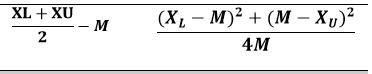
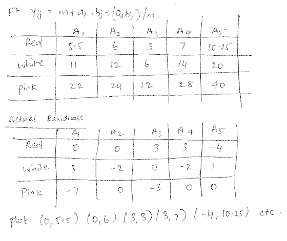

1. (a) Calculate 5 Number summary fow wt2

```{r}
wt2<-c(143,-184,182,-110,1017,986,1010,1001,-111,-60,-151,-111,1024,1031,1028)
summary(wt2)
```

(b) Stem leaf plot

According to Tukey, the range of the dataset determines the lines on the stem leaf plot.
Range can be given as follows,

```{r}
library(aplpack)
range.wt2<-(range(wt2)[2]-range(wt2)[1])/length(wt2)
range.wt2
stem.leaf(wt2,100)
```
Another way of representing this is using the stem command,

```{r}
stem(wt2,2)
```

Below is the box plot of wt2 and it can be seen that there are no outliers.
```{R}
boxplot(wt2,horizontal = TRUE,main="wt2 dataset box plot")
```

-----

2. "Outsides values in a box plot"

The average outside values in a batch can be given by the formula 0.4+0.07n where n is the number of elements in the batch. considering 5000 elements, outliers are as follows,

```{R}
noOutliers<-function(x){0.4+(0.007*x)}
noOutliers(5000)
```

Lets check the correctness of above predicted number. Lets generate 5000 random values and check the outliers.
```{R}
set.seed(3)
boxplot(rnorm(5000,mean=5,sd=0.5),horizontal = TRUE,main="Simulation of Random 5000 samples")
```
Above graph has about 30 outliers which is right about the estimate we have done.

-------

3. (a) Stem Leaf plot:

It can be seen that the distribution is left skewed and has heavy right tails. This can be visually seen clearly. Since the aim of the stem leaf plot is just the inference of the distribution and does it purpose, there is no need for any transformation.

Incase a transformation is required, since the distribution is left skewed going up the tukey's power ladder would help.

(b) Given that there are 5 box and has f spreads 13,1,10,8,4.

Assuming that these are from a same batched plotted against categorical data, ie mean salary in Indiana, California, Texas etc and these box plots have given spreads.

It would be wise to transform. Now, we would want to "pull in" the data towards median such that the spread is equalized. ie transformation for spread. Ideally here a log transformation should work, however following,



The second expression is marked in X axis and first expression is marked in Y axis.
1-slope of the above plot decides the power for transformation.

(c) The above plot has data concentrated in the center. Also has heavy left and right tail. One plausible explanation is that the transformation may be bimodal. In such cases, no transformation would be required.

(d) This transformation has heavy right tail and light left tail. Hence now we want to "pull in" data, hence we have to descend Tukey's power ladder. Hence square root/log would be a good place to start. y stays its own scale, x would be either a square root or log transformation.

-------

4. Smoothers in general tries to identify the patterns in the data. They remove noise signals and try to replicate the trends of the actual data. Linear smoothers are smoothers which transform the data linearly. This is usually a convolution function.

Examples of Linear Smoothers,

1. Running Mean
2. Cubic Spline Smoothers
3. Lowess Smoother

Disadvantages of Linear Smoother,

1. Over fits the data, attempts to fit every point available
2. Since it attempts to fit every point, they are affected by outliers
3. Some linear smoothers like LOWESS filters require fairly dense points for smoothing.

Advantage and Disadvantage of Non linear smoothers

1. Since Non linear smoothers doesn't have linear constraints, they are quite flexible
2. Since they involve medians, they are more robust than the other methods and are less affected by the outliers
3. Requires more computation than linear smoothers. Usually require denser data.

-----

5. (a) Initial RR line on the plot.

```{R}
source("myplotfit.r")
source("rrline.r")
x<-c(0.450,0.45,0.450,1.300,1.300,1.300,2.400,2.400,2.400,4.000,4.00,4.000,6.100,6.100,6.100,8.05,8.050,8.050,11.150,11.150,11.150,13.150,13.150,13.150,15.000,15.00,15.000)
y<-c(0.342,0.00,0.825,1.780,0.954,0.641,1.751,1.275,1.173,3.123,2.61,2.574,3.179,3.008,2.671,3.06,3.943,3.437,4.807,3.356,2.783,5.138,4.703,4.257,3.604,4.15,3.425)
#Run one iteration of RR
rrline.x<-rrline1(x,y)
plot(x,y,main="Scatter plot of time and cal",xlab = "time",ylab = "cal")
abline(rrline.x$a,rrline.x$b)
paste("Intercept : ",rrline.x$a," Slope : ",rrline.x$b)
```

(b) One method that is sucessive fitting of the residuals to the Resistant regression line. Once one iteration of the RR is completed, the residuals are taken as y axis and is plotted against x. An RR is made to fit the residuals and this is done successively till the RR line becomes flat. Another option is to use transform for straightness, 

Let mx and my be the medians for x and y and c be the slope of the RR line,
y-my-c(x-mx) as vertical coordinates, c2(x-mx)2/2mx as coordinates.

(c) The Y values are as it is, however X axis is transformed. The Transformed used is square root.
```{R}
sqrtx<-sqrt(x)
plot(sqrtx,y,main="Transformed plot",xlab="log(x)",ylab="y")
```

(d) RR on panel b
```{R}
sqrtx<-sqrt(x)
plot(sqrtx,y,main="Transformed plot",xlab="log(x)",ylab="y")
rrline.sqrtx<-rrline1(sqrtx,y)
abline(rrline.sqrtx$a,rrline.sqrtx$b,lty=2,col="red")
paste("Intercept : ",rrline.sqrtx$a," Slope : ",rrline.sqrtx$b)
```

(e) A general observation is that the residual plot of the panel b has more random points than the residual plot of panel a. More random the residual plot, better the fit model.
```{r}
rrline.x$sumres
rrline.sqrtx$sumres
```
Also an observation is that sum of residuals of plot b is lesser than plot a, ie the model fits better than the plot 1.

(f) RR after two iterations.

```{r}
source("myplotfit.r")
source("rrline.r")
x<-c(0.450,0.45,0.450,1.300,1.300,1.300,2.400,2.400,2.400,4.000,4.00,
     4.000,6.100,6.100,6.100,8.05,8.050,8.050,11.150,11.150,11.150,
     13.150,13.150,13.150,15.000,15.00,15.000)
y<-c(0.342,0.00,0.825,1.780,0.954,0.641,1.751,1.275,1.173,3.123,2.61,
     2.574,3.179,3.008,2.671,3.06,3.943,3.437,4.807,3.356,2.783,5.138,
     4.703,4.257,3.604,4.15,3.425)

intercept <- 0.256
slope <- -0.124
r.new <- slope*x+intercept
#Iteration 2
rr1<-rrline2(x,r.new)
paste("Intercept : ",rr1$a," Slope : ",rr1$b)
```

It is interesting to know that the slope and intercept did not change even after two iterations.

-----

6. (a) Median Polish

```{r}
source("myplotfit.r")
source("rrline.r")
red<-c(5,6,3,11,10)
white<-c(14,10,6,12,21)
pink<-c(16,24,15,26,32)
mat<-rbind(red,white,pink)
colnames(mat)<-c("A1","A2","A3","A4","A5")
res<-medpolish(mat)
print(res)
```
Since the plot if tilted 45 degrees, we can now compare the effects with other effects. It can be seen that A5 Treatment 2 has similar effects as A4 treatment three.

(b) Quality of the fit can be given by Analog R2. Its curious that the overall effects (12) is same as the median (12).

```{r}
Analog_R_Square<- 1-((sum(abs(res$residuals))) /(sum(abs(mat-res$overall))))
paste("Analog R2 : ",Analog_R_Square)
```

(c) Diagnostic Plot

```{r}
diag.MP(res)
```

Diagnostic plot tells us that how good the model is. If the residuals are along 0, Then the model is good.

Assuming the model is a perfect fit, a perfect fit matrix is calculated as below.



A full fit, y= m+ai+bj+(aibj)/m and the residuals are plotted as pairs as explained above.

(d) Forget it plot and Symbol Plot
```{r}
forgetitplot(res)
```
An interpretation of the plot is that A5 is farthest away from any immediate areas and Pink is the farthest away from other immediate points. Hence these these points have the maximum values of incoming insects.

-----

7 (a) Verify the Regression Identity.

To prove,

$R(\hat{\mu})=\frac{1}{n}  \sum_{i=1}^{n} E [ \hat{\mu}(t_i) - \mu(t_i) ]^{2}$ 

=

$\frac{1}{n}  \sum_{i=1}^{n} [ E \hat{\mu}(t_i) - \mu(t_i) ]^{2} + \frac{1}{n} \sum^{n}_{i=1} var(\hat{\mu}(t_i))$  


Let $\hat{\mu}(t_i)$ = $\hat{\theta}$

$\mu(t_i)$=$\theta$  ,
    
    
Hence the L.H.S, $E(\hat{\theta} -\theta )^2$ ,

Adding and subtracting $E[\hat{\theta}]$ inside the expectation,

= $E(\hat{\theta} -E[\hat{\theta}]+E[\hat{\theta}] - \theta)$ ,

= $E(\hat{\theta} - E[\theta])^2$ + $E(E(\hat{\theta})-\theta)^2$ + $2E(\hat{\theta} -E[\hat{\theta}])E(\hat[{\theta}] - \theta)$  ,

Now,                          

$2E(\hat{\theta} -E[\hat{\theta}])E(\hat{\theta}] - \theta) == 0$  as $\displaystyle\int\limits^{{\infty}}_{{-{\infty}}} x\mathrm{E}(x)\,\mathrm{d}x = 0 since it is a constant$

$E[\hat{\theta} - E[\theta]]^2 = Var(\hat{\theta})=var(\hat{\mu}(t_i))$  

$E(\hat{\theta}-\theta)^2 = [ E \hat{\mu}(t_i) - \mu(t_i) ]^{2}$ 

(b) K Smooth for various lambda values for normal kernel.

```{r}
mu<-read.csv("smoothing.csv",header = FALSE)
x<-mu$V1
y<-mu$V2
mu = function(t){t + 0.5 *exp(-50*(t-0.5)^2)}
curve(mu(x),0,1,col="red",main="Kernel Smoothing with normal kernel")
points(x,y)
t=ksmooth(x,y,kernel="normal",bandwidth=0.5)
lines(t$x,t$y,col="violet",lty=2)
text(t$x[1],t$y[1],"Bandwidth = 0.5",col="violet")
t=ksmooth(x,y,kernel="normal",bandwidth=0.3)
lines(t$x,t$y,col="orange",lty=2)
text(t$x[20],t$y[20],"Bandwidth = 0.3",col="orange")
t=ksmooth(x,y,kernel="normal",bandwidth=0.25)
lines(t$x,t$y,col="blue")
text(t$x[30],t$y[30],"Bandwidth = 0.25",col="blue")
t=ksmooth(x,y,kernel="normal",bandwidth=0.15)
lines(t$x,t$y,lty=5)
text(t$x[40],t$y[40],"Bandwidth = 0.15")
```

K Smooth for various lambda values for box kernel
```{r}
mu<-read.csv("smoothing.csv",header = FALSE)
x<-mu$V1
y<-mu$V2
mu = function(t){t + 0.5 *exp(-50*(t-0.5)^2)}
curve(mu(x),0,1,col="red",main="Kernel Smoothing with box kernel")
points(x,y)
t=ksmooth(x,y,kernel="box",bandwidth=0.5)
lines(t$x,t$y,col="violet",lty=2)
text(t$x[1],t$y[1],"Bandwidth = 0.5",col="violet")
t=ksmooth(x,y,kernel="box",bandwidth=0.3)
lines(t$x,t$y,col="orange",lty=2)
text(t$x[20],t$y[20],"Bandwidth = 0.3",col="orange")
t=ksmooth(x,y,kernel="box",bandwidth=0.25)
lines(t$x,t$y,col="blue")
text(t$x[30],t$y[30],"Bandwidth = 0.25",col="blue")
t=ksmooth(x,y,kernel="box",bandwidth=0.15)
lines(t$x,t$y,lty=5)
text(t$x[40],t$y[40],"Bandwidth = 0.15")
```

(c) Function for calculating cross validation

```{r}
cv <- function(x, y, lambda)
{
  n <- length(x)
  cv.total <- numeric(n)
  for(i in 1:n)
  {
    fit = ksmooth(x[-i], y[-i], kernel = "normal", bandwidth = lambda, n.points = n)
    cv.total[i] = (y[i] - fit$y[i])^2
  }
  mean.cv<-mean(cv.total)
  return(mean.cv)

}
```

(d) Plot for CV values vs lambda

```{r}
x <- seq(0.01, 0.99, by = 0.02)
y <- c(-.0937, .0247, .1856, .1620, -.0316, .1442, .0993, .3823, -.0624, .3262, .1271, -.4158, .0975, -.0836, .7410, .3749, .4446, .5432, .6946, .5869, .9384, .7647, .9478, .9134, 1.2437, .9070, 1.2289, .9638, .8834, .6982, .5729, .7160, 1.0083, .6681, .5964, .4759, .6217, .6221, .6244, .5918, .7047, .5234, .9022, .9930, .8045, .7858, 1.1939, .9272, .8832, .9751)

  lambda = seq(0.01, 1, by = 0.01)
  cv.plot = c()
  for(i in 1:length(lambda))
  {
    cv.temp = cv(x, y, lambda[i])
    cv.plot = c(cv.plot, cv.temp)
  }
  plot(lambda, cv.plot,main="Lambda Vs CV Values")
  lmin = lambda[which.min(cv.plot)]
  paste("Lambda Minimum is : ",lmin)
```

(e) Smoothing Splines

```{r}
x = seq(0.01, 0.99, by = 0.02)
y = c(-.0937, .0247, .1856, .1620, -.0316, .1442, .0993, .3823, -.0624, .3262, .1271, -.4158, .0975, -.0836, .7410, .3749, .4446, .5432, .6946, .5869, .9384, .7647, .9478, .9134, 1.2437, .9070, 1.2289, .9638, .8834, .6982, .5729, .7160, 1.0083, .6681, .5964, .4759, .6217, .6221, .6244, .5918, .7047, .5234, .9022, .9930, .8045, .7858, 1.1939, .9272, .8832, .9751)
mu = function(t){t + 0.5 *exp(-50*(t-0.5)^2)}
curve(mu(x),0,1,col="red",main="Kernel Smoothing Smoothing Spline")
points(x,y)
t=smooth.spline(x,y,spar = 0.5)
lines(t$x,t$y,col="violet",lty=2)
text(t$x[1],t$y[1],"Bandwidth = 0.5",col="violet")
t=smooth.spline(x,y,spar = 0.3)
lines(t$x,t$y,col="orange",lty=2)
text(t$x[20],t$y[20],"Bandwidth = 0.3",col="orange")
t=smooth.spline(x,y,spar = 0.8)
lines(t$x,t$y,col="blue")
text(t$x[30],t$y[30],"Bandwidth = 0.25",col="blue")
t=smooth.spline(x,y,spar = 0.2)
lines(t$x,t$y,lty=5)
text(t$x[40],t$y[40],"Bandwidth = 0.15")
```
From the above graph, it can be seen that as the smoothing parameter decreases, the smoother tries to capture all the points, hence is more distorted

```{r}
cv.spline <- function(x, y, lambda)
{
  fit = smooth.spline(x,y,spar = lambda,cv=TRUE)
  return(fit$cv.crit)

}

cv.spline.gcv <- function(x, y, lambda)
{
  fit = smooth.spline(x, y,spar = lambda,cv=FALSE)
  return(fit$cv.crit)

}
```
```{r}
x = seq(0.01, 0.99, by = 0.02)
y = c(-.0937, .0247, .1856, .1620, -.0316, .1442, .0993, .3823, -.0624, .3262, .1271, -.4158, .0975, -.0836, .7410, .3749, .4446, .5432, .6946, .5869, .9384, .7647, .9478, .9134, 1.2437, .9070, 1.2289, .9638, .8834, .6982, .5729, .7160, 1.0083, .6681, .5964, .4759, .6217, .6221, .6244, .5918, .7047, .5234, .9022, .9930, .8045, .7858, 1.1939, .9272, .8832, .9751)

  lambda = seq(0.01, 1, by = 0.01)
  cv.plot.spline = c()
  cv.plot.spline.gcv = c()
  for(i in 1:length(lambda))
  {
    cv.temp = cv.spline(x, y, lambda[i])
    cv.plot.spline = c(cv.plot.spline, cv.temp)
  }
  lmin = lambda[which.min(cv.plot.spline)]
  paste("Lambda Minimum is : ",lmin)
   for(i in 1:length(lambda))
   {
     cv.temp = cv.spline.gcv(x, y, lambda[i])
     cv.plot.spline.gcv = c(cv.plot.spline.gcv, cv.temp)
   }
  lmin = lambda[which.min(cv.plot.spline.gcv)]
  paste("Lambda Minimum for GCV  is : ",lmin)
  plot(lambda, cv.plot.spline,main="Lambda Vs CV/GCV Values",col="red",type="l")
  lines(lambda,cv.plot.spline.gcv,col="blue")
  legend("topright",c("CV","GCV"),lty=c(1,1),col=c("red","blue"))
```
GCV values are higher than the CV values, which is expected. Since GCV is calculated with a formula rather than the iterative process, GCV is asymptotically faster.

-----